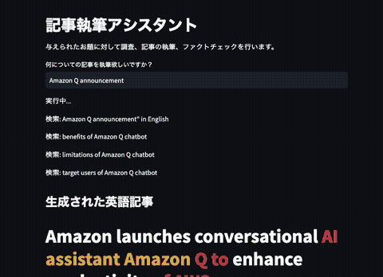

# Generative AI Journalism Assistant

This is a demo application of Journalism Assistant Agent based on Anthropic Claude on Amazon Bedrock.

自動で文献を調査し記事を作成してくれる Agent のデモアプリケーションです。Amazon Bedrock の Anthropic Claude を利用しています。

このサンプルでは無料利用枠の大きさ・リクエスト数の制限・コストの観点から [Brave Search API の Data for AI](https://brave.com/search/api/) を使用しています。API キーの取得はフリープランでもクレジットカードの登録が必要になります。

## Demo



## Run Locally

Amazon Bedrock への権限が付与された AWS プロファイルが必要です。また、利用しているリージョンの Anthropic Claude Instant モデルを有効化する必要があります。

```
make local-streamlit
```

or 

```
export BRAVE_API_KEY=BSANO2wi1X7VobnaHKDZiKtSSUVLJbs
streamlit run streamlit-docker/Welcome.py
```

## Deploy to AWS

Run this command to initialize cdk project.

```
make prepare-deploy-streamlit
```

Run this command to deploy application afterwards.

```
make deploy-streamlit
```

## License

[MIT](./LICENSE)

